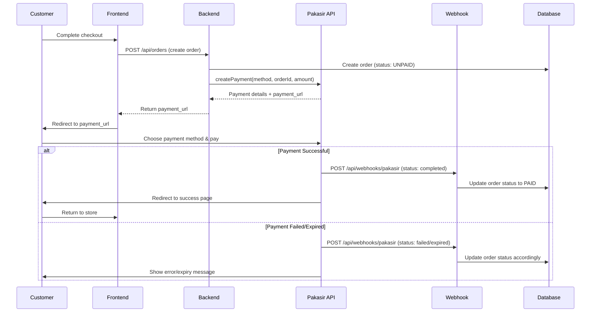
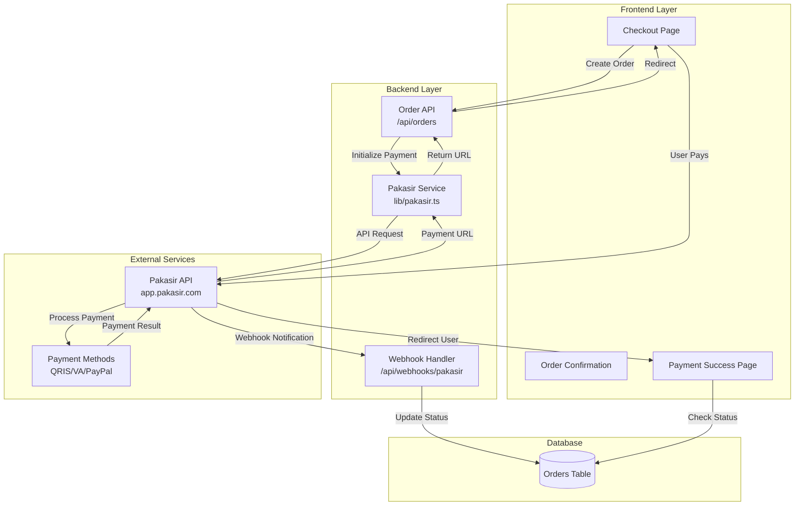
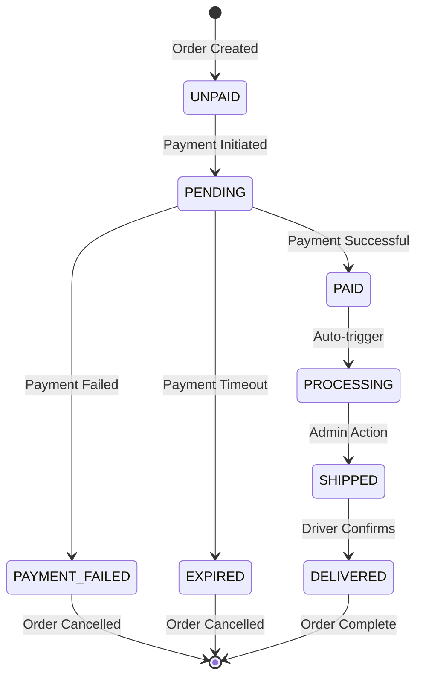

# Pakasir Payment Gateway Integration

## Overview

Pakasir is an Indonesian payment gateway that supports multiple payment methods including **QRIS**, **Virtual Accounts** (multi-bank), and **PayPal**. This document explains how to integrate Pakasir into the Harkat Furniture e-commerce platform.

---

## Payment Flow Diagram



---

## Architecture Components



---

## Supported Payment Methods

| Method | Code | Min Amount | Description |
|--------|------|------------|-------------|
| **QRIS** | `qris` | Rp 1,000 | Universal QR code payment |
| **BCA VA** | `bca_va` | Rp 10,000 | BCA Virtual Account |
| **BNI VA** | `bni_va` | Rp 10,000 | BNI Virtual Account |
| **BRI VA** | `bri_va` | Rp 10,000 | BRI Virtual Account |
| **Mandiri VA** | `mandiri_va` | Rp 10,000 | Mandiri Virtual Account |
| **Permata VA** | `permata_va` | Rp 10,000 | Permata Virtual Account |
| **PayPal** | `paypal` | Rp 10,000 | International PayPal |
| **All Methods** | `all` | Varies | User selects on payment page |

---

## Implementation Steps

### 1. Install Pakasir SDK

```bash
npm install pakasir-sdk
```

### 2. Configure Environment Variables

Add to `.env`:

```env
# Pakasir Configuration
PAKASIR_SLUG=your-store-slug
PAKASIR_API_KEY=sk_live_your_api_key
# For testing: sk_test_your_api_key

# Webhook URL (must be publicly accessible)
NEXT_PUBLIC_BASE_URL=https://yourdomain.com
```

### 3. Create Pakasir Service (`src/lib/pakasir.ts`)

```typescript
import { Pakasir } from 'pakasir-sdk';

export const pakasirClient = new Pakasir({
  slug: process.env.PAKASIR_SLUG!,
  apikey: process.env.PAKASIR_API_KEY!
});

export type PaymentMethod = 
  | 'qris' 
  | 'bca_va' 
  | 'bni_va' 
  | 'bri_va' 
  | 'mandiri_va' 
  | 'permata_va' 
  | 'paypal' 
  | 'all';

export async function createPayment(
  method: PaymentMethod,
  orderId: string,
  amount: number,
  redirectUrl?: string
) {
  return await pakasirClient.createPayment(
    method,
    orderId,
    amount,
    redirectUrl
  );
}

export async function checkPaymentStatus(
  orderId: string,
  amount: number
) {
  return await pakasirClient.detailPayment(orderId, amount);
}

export async function calculateFee(
  method: PaymentMethod,
  amount: number
) {
  return await pakasirClient.getPaymentInfo(method, amount);
}
```

### 4. Update Order Creation API (`src/app/api/orders/route.ts`)

```typescript
import { createPayment } from '@/lib/pakasir';

export async function POST(req: Request) {
  const body = await req.json();
  
  // 1. Create order in database with status UNPAID
  const order = await prisma.order.create({
    data: {
      ...body,
      status: 'UNPAID',
      totalAmount: calculateTotal(body.items)
    }
  });
  
  // 2. Initialize payment with Pakasir
  const payment = await createPayment(
    'all', // Let user choose payment method
    order.id,
    order.totalAmount,
    `${process.env.NEXT_PUBLIC_BASE_URL}/orders/${order.id}/success`
  );
  
  // 3. Save payment details
  await prisma.order.update({
    where: { id: order.id },
    data: {
      paymentUrl: payment.payment_url,
      paymentMethod: payment.payment_method,
      paymentExpiry: payment.expired_at
    }
  });
  
  // 4. Return payment URL to frontend
  return Response.json({
    orderId: order.id,
    paymentUrl: payment.payment_url,
    expiresAt: payment.expired_at
  });
}
```

### 5. Create Webhook Handler (`src/app/api/webhooks/pakasir/route.ts`)

```typescript
import { NextRequest } from 'next/server';
import { checkPaymentStatus } from '@/lib/pakasir';

export async function POST(req: NextRequest) {
  try {
    const body = await req.json();
    
    // Pakasir webhook payload
    const { order_id, amount, status } = body;
    
    // Verify payment status with Pakasir API
    const paymentDetail = await checkPaymentStatus(order_id, amount);
    
    // Update order status based on payment status
    if (paymentDetail.status === 'completed') {
      await prisma.order.update({
        where: { id: order_id },
        data: {
          status: 'PAID',
          paidAt: new Date(paymentDetail.completed_at!),
          paymentNumber: paymentDetail.payment_number
        }
      });
      
      // TODO: Send confirmation email/WhatsApp
      // TODO: Trigger order processing workflow
    } else if (paymentDetail.status === 'failed') {
      await prisma.order.update({
        where: { id: order_id },
        data: { status: 'PAYMENT_FAILED' }
      });
    } else if (paymentDetail.status === 'expired') {
      await prisma.order.update({
        where: { id: order_id },
        data: { status: 'EXPIRED' }
      });
    }
    
    return Response.json({ success: true });
  } catch (error) {
    console.error('Webhook error:', error);
    return Response.json({ error: 'Webhook processing failed' }, { status: 500 });
  }
}
```

### 6. Update Checkout Frontend (`src/app/checkout/page.tsx`)

```typescript
'use client';

import { useState } from 'react';
import { useRouter } from 'next/navigation';

export default function CheckoutPage() {
  const router = useRouter();
  const [loading, setLoading] = useState(false);
  
  async function handleCheckout() {
    setLoading(true);
    
    try {
      // Create order and get payment URL
      const response = await fetch('/api/orders', {
        method: 'POST',
        headers: { 'Content-Type': 'application/json' },
        body: JSON.stringify({
          items: cartItems,
          shippingAddress: address,
          // ... other order data
        })
      });
      
      const { paymentUrl, orderId } = await response.json();
      
      // Redirect to Pakasir payment page
      window.location.href = paymentUrl;
      
    } catch (error) {
      console.error('Checkout failed:', error);
      alert('Gagal membuat pesanan. Silakan coba lagi.');
    } finally {
      setLoading(false);
    }
  }
  
  return (
    <button 
      onClick={handleCheckout}
      disabled={loading}
    >
      {loading ? 'Memproses...' : 'Bayar Sekarang'}
    </button>
  );
}
```

---

## Payment Status Flow



---

## Fee Calculation

Pakasir charges fees based on payment method:

### Fee Structure

| Payment Method | Fee |
|----------------|-----|
| **QRIS** | 0.7% + Rp 310 |
| **BRI VA** | Rp 3,500 |
| **BNI VA** | Rp 3,500 |
| **ATM Bersama VA** | Rp 3,500 |
| **BNC VA** | Rp 3,500 |
| **CIMB Niaga VA** | Rp 3,500 |
| **Maybank VA** | Rp 3,500 |
| **Permata VA** | Rp 3,500 |
| **Artha Graha VA** | Rp 2,000 |
| **Sampoerna VA** | Rp 2,000 |

### Fee Calculation Examples

```typescript
// Example 1: QRIS payment for Rp 100,000
const qrisAmount = 100000;
const qrisFee = (qrisAmount * 0.007) + 310;  // Rp 1,010
const qrisTotal = qrisAmount + qrisFee;       // Rp 101,010

// Example 2: BRI Virtual Account for Rp 500,000
const vaAmount = 500000;
const vaFee = 3500;                           // Flat Rp 3,500
const vaTotal = vaAmount + vaFee;             // Rp 503,500

// Use Pakasir SDK to get exact fees
const feeInfo = await pakasirClient.getPaymentInfo('qris', 100000);
console.log(`Amount: Rp${feeInfo.amount}`);        // 100000
console.log(`Fee: Rp${feeInfo.fee}`);              // 1010
console.log(`Total: Rp${feeInfo.total_payment}`);  // 101010
```

> [!IMPORTANT]
> **Fee Handling Options:**
> 1. **Absorb the fee**: Display `amount` to customer, you pay the fee
> 2. **Pass to customer**: Display `total_payment` to customer (recommended)
> 3. **Split the fee**: Custom calculation
> 
> **Recommendation**: For QRIS, passing the fee to customers is common practice. For Virtual Accounts, consider absorbing the flat fee as a customer service gesture.

---

## Testing with Sandbox

```typescript
// Use test API key
const pakasir = new Pakasir({
  slug: 'my-store-sandbox',
  apikey: 'sk_test_abc123xyz'
});

// Create test payment
const payment = await pakasir.createPayment('qris', 'TEST-001', 50000);

// Simulate successful payment (sandbox only)
const completed = await pakasir.simulationPayment('TEST-001', 50000);

console.log(completed.status); // 'completed'
```

---

## Security Best Practices

> [!CAUTION]
> **Critical Security Measures:**

1. **Always verify webhook data** by calling `detailPayment()` API
2. **Never trust webhook payload alone** - validate with Pakasir API
3. **Store API keys in environment variables** - never commit to Git
4. **Use HTTPS for webhook URLs** - required by Pakasir
5. **Implement idempotency** - handle duplicate webhook calls
6. **Validate order amounts** - ensure webhook amount matches order

---

## Webhook Configuration

Configure your webhook URL in Pakasir dashboard:

```
https://yourdomain.com/api/webhooks/pakasir
```

> [!WARNING]
> **Webhook Requirements:**
> - Must be publicly accessible (not localhost)
> - Must use HTTPS in production
> - Must respond with 200 status code
> - Should process within 5 seconds

---

## Error Handling

```typescript
try {
  const payment = await createPayment('qris', orderId, amount);
} catch (error) {
  if (error.message.includes('Invalid API key')) {
    // Handle authentication error
  } else if (error.message.includes('Amount too low')) {
    // Handle minimum amount error
  } else {
    // Handle other errors
  }
}
```

---

## Next Steps

- [ ] Install `pakasir-sdk` package
- [ ] Set up environment variables
- [ ] Create Pakasir service file
- [ ] Update order creation API
- [ ] Implement webhook handler
- [ ] Update checkout frontend
- [ ] Configure webhook URL in Pakasir dashboard
- [ ] Test with sandbox API key
- [ ] Switch to production API key when ready

---

## Additional Resources

- **Pakasir SDK (TypeScript)**: [/zeative/pakasir-sdk](https://context7.com/zeative/pakasir-sdk)
- **Pakasir SDK (PHP)**: [/itsazni/pakasir-sdk-php](https://context7.com/itsazni/pakasir-sdk-php)
- **Official Website**: [pakasir.com](https://pakasir.com)
